<!-- Optional: drop a logo image at docs/logo.png and it will render here. -->
<h1 align="center">ParkFlow-AI</h1>

<p align="center">
<b>Predicting &amp; Mitigating Parking-Induced Traffic Disruptions</b><br/>
AI-driven parking-enforcement intelligence for the Bengaluru Traffic Police. It forecasts where
violations will spike, quantifies how much they choke traffic, and tells patrols exactly where to
go — turning reactive enforcement into proactive, data-driven deployment.
</p>

<p align="center"><em> Flipkart Gridlock Hackathon 2.0 </em></p>

---

## 1. Problem Statement

On-street illegal parking near markets, metro stations and junctions chokes Bengaluru's roads.
Enforcement today is **reactive and patrol-based**:

- No city-wide view of *where* and *when* violations cluster.
- No way to *quantify* how much a parking violation hurts traffic flow.
- No data-driven way to *prioritize* which zones to enforce first.

> **The ask:** *Can AI detect illegal-parking hotspots and quantify their impact on traffic flow,
> so enforcement becomes proactive and targeted?*

---

## 2. Solution

ParkFlow-AI converts ~298k historical BTP violation records into forward-looking enforcement
intelligence. It aggregates violations to **junction × time-window** cells, forecasts the **next 24
hours** (recursive multi-horizon) with a gradient-boosted model, converts that into an estimated
**road-capacity loss** and a **rupee cost of commuter delay**, then produces a **route-optimized**
patrol plan (OR-Tools VRP) and simulates how offenders **displace** when enforcement arrives — all
served on a Streamlit dashboard that reads precomputed artifacts and lets operators **act** on them
(confirm/override/complete deployments). Everything is computed from the provided data plus published
traffic-engineering constants — **no external datasets or APIs**.

**Pipeline (high level)**

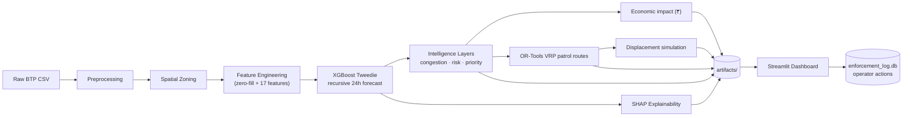

### 2.1 State of the art

Spatio-temporal violation forecasting is typically framed either as classical time-series
(ARIMA / exponential smoothing — poor with sparse, zero-heavy spatial grids) or as deep
spatio-temporal models (LSTM / STGCN — heavy and data-hungry). For tabular, sparse,
heterogeneous urban-violation data over a few months, **gradient-boosted trees with a
count-appropriate objective** are the practical state of the art: strong accuracy, fast to train,
interpretable via SHAP, and robust to mixed feature types. ParkFlow-AI uses an **XGBoost regressor
with a Tweedie objective** (compound Poisson-Gamma) to handle the zero-inflation and overdispersion
inherent to parking violations, benchmarked against a seasonal-naive baseline.

### 2.2 Architecture

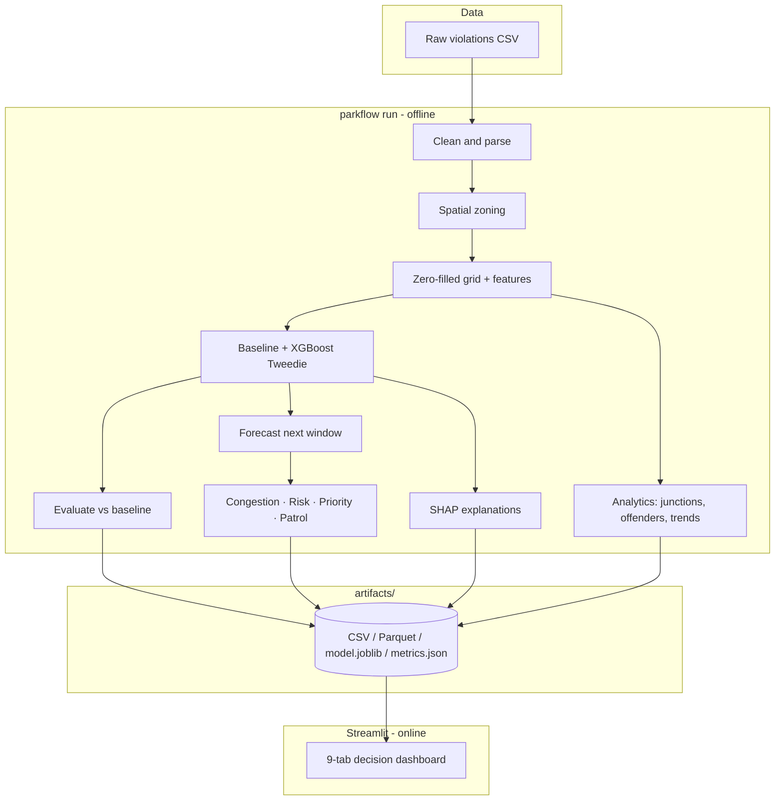

### 2.3 Data preprocessing techniques

| Technique | Why / where it is used |
|---|---|
| Drop admin columns | Remove non-predictive workflow fields (device id, timestamps, etc.) |
| JSON-array violation parsing | `violation_type` is a JSON array per record; extract the parking tags |
| UTC → IST conversion | So hour-of-day features reflect **local** commute time, not UTC |
| Validation-status filter | Drop `rejected` / `duplicate` records to remove false positives |
| Deduplication | Remove repeated captures of the same event (vehicle+lat+lon+time) |
| Missing-value imputation | Fill missing junction / police-station labels with a sentinel |
| Spatial zoning (junction + grid fallback) | Map each event to an enforcement zone; junctions primary, ~1 km grid otherwise |
| Frequency encoding | Encode the high-cardinality **junction/zone name** as a numeric feature |
| Complete-grid zero-fill | Create rows for quiet zone-windows so the model learns lulls, not only spikes |
| Lag / rolling features | Capture temporal momentum from past windows (leakage-safe, past-only) |

### 2.4 Modelling equations

**Target** — expected violation count $\hat{y}$ for a zone in a future time window.

**Tweedie objective** (variance–mean relation, $1 < p < 2$ = compound Poisson-Gamma, matching
zero-inflated counts):

$$V(\mu) = \phi\,\mu^{p}, \qquad 1 < p < 2$$

**Parking Congestion Impact Index** (PCU = Passenger-Car-Units; $r$ = road factor; $C_{\max}$ = max
capacity-loss percentage; $S$ = saturation constant — Indo-HCM saturation-flow principle). Here
$\hat{\rho}$ is the estimated road-capacity reduction:

$$L = \hat{y}\cdot \overline{\text{PCU}}\cdot r$$

$$\hat{\rho} = C_{\max}\left(1 - e^{-L/S}\right)$$

$$\text{CongestionIndex} = 100 \cdot \frac{\hat{\rho}}{C_{\max}}$$

**Enforcement priority** (min-max normalised components $\tilde{y},\tilde{h}$; $j$ = junction flag):

$$P = 100\left(0.6\,\tilde{y} + 0.3\,\tilde{h} + 0.1\,j\right)$$

**Economic impact** (rupee cost of commuter delay; $n_v$ = vehicles blocked per violation;
$t_{\max}$ = delay at full block; $o$ = occupancy; $w$ = value of time). The value of time
$w \approx$ ₹164/commuter-hour is **derived from the only economic source used**, the Bengaluru
ISEC study WP-554 (2023): ₹11,45,568 ÷ 6,998 hours lost ≈ ₹163.7/hr. The model is per-commuter
(as in the paper), so $o=1.0$; $n_v$ and $t_{\max}$ are the project's own tunable assumptions.
Delay is tied to the same estimated capacity reduction $\hat{\rho}$, so the money figure inherits
the PCU / Indo-HCM grounding:

$$\text{Cost}_{\text{INR}} = \underbrace{\hat{y}\,n_v}_{\text{vehicles delayed}} \cdot
  \underbrace{t_{\max}\tfrac{\hat{\rho}}{100}}_{\text{delay hrs/veh}} \cdot\; o \cdot w$$

**Displacement** (behavioural response; $\delta$ = displaced fraction). For a *covered* zone $z$, a
share of its predicted violations relocates to the nearest *uncovered* zone $u$ within radius $R$:

$$\text{out}(z) = \delta\,\hat{y}_z, \qquad
  \text{in}(u) \mathrel{+}= \text{out}(z)\;\;\text{if}\;\; d(z,u)\le R,\;\text{else suppressed}$$

### 2.5 Evaluation and validation

- **Time-based split** — train on the earliest 80% of the timeline, test on the unseen latest 20%
  (simulates real forecasting; **no leakage** — all lags use past values only).
- **Baseline** — a seasonal-naive predictor (zone × hour-of-week mean) the model must beat.
- **Metrics** — MAE, RMSE, R², Poisson deviance (regression) + Top-K hit-rate and hotspot PR-AUC
  (ranking metrics, better suited to sparse, imbalanced hotspot data).

---

## 3. What makes it strong

| Strength | Why it matters |
|---|---|
| **Parking Congestion Impact Index** | Estimates **% road capacity lost** via PCU + Indo-HCM principles — directly answers the "impact on traffic flow" ask, with **no external data** |
| **Tweedie forecasting** | Handles zero-inflated, overdispersed counts far better than plain Poisson/Gaussian |
| **Zero-filled grid** | The model learns *quiet* windows, not just busy ones — the key correctness step |
| **SHAP explainability** | Every alert is explainable per zone — builds trust with enforcement officers |
| **Repeat-offender intelligence** | Separates willful blockers (towing) from infrastructure issues (signage/space) |
| **Route-optimized patrols** | OR-Tools VRP plans each team's ordered route over a haversine matrix — not a greedy 1 km rule (greedy fallback if OR-Tools absent) |
| **Rolling 24h forecast** | Recursive multi-horizon (8×3h bins), not a single next-window snapshot — the command centre sees the whole day ahead |
| **Economic framing** | Converts predictions into ₹ of commuter productivity lost (≈ ₹164/commuter-hour, derived from the Bengaluru ISEC study WP-554, 2023) — the business case judges ask for |
| **Displacement-aware** | Simulates offenders re-parking nearby when enforced — quantifies blindspot leakage (novel systems-thinking layer) |
| **Operator workflow** | Confirm / override / complete deployments persisted to SQLite — an operations tool, not just a report |
| **Honest evaluation** | Beats a real baseline on a held-out *future* window — no leakage, no inflated numbers |

---

## 4. How it works

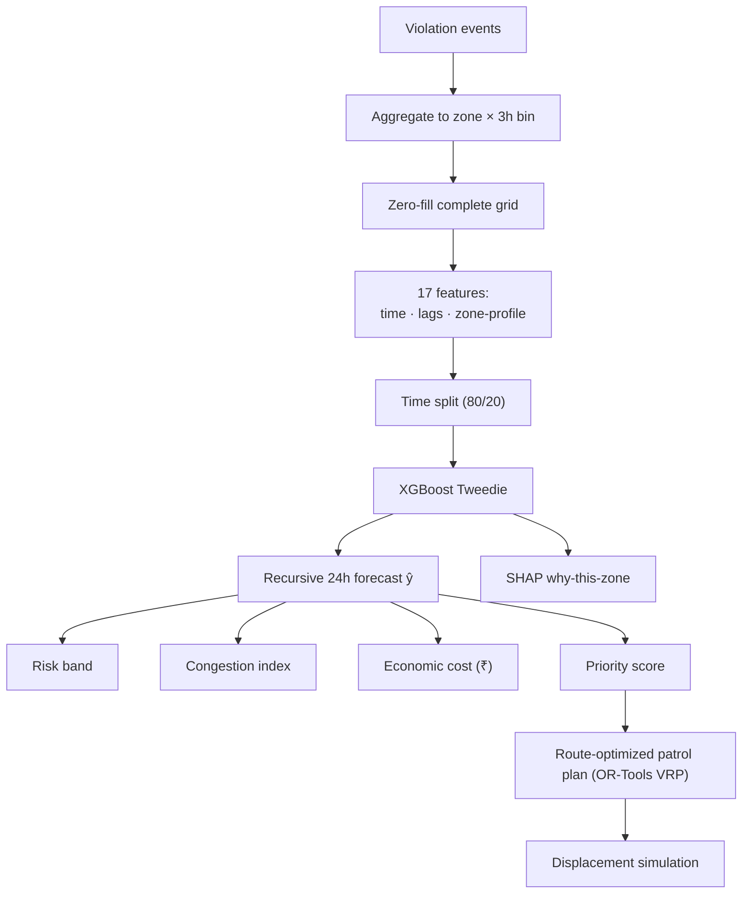

1. **Aggregate** events to `zone × 3-hour` counts, then **zero-fill** the full grid.
2. Engineer **17 leakage-safe features** (time, lags/rolling, zone profile).
3. Split by time, train the **Tweedie XGBoost** vs the **seasonal-naive baseline**.
4. Forecast the **next 24h** (recursive multi-horizon), then derive **risk band**, **congestion index**,
   **economic cost (₹)**, **priority**, **route-optimized patrol plan**, and a **displacement** simulation.
5. Compute **SHAP** explanations; write everything to `artifacts/` for the dashboard (operator actions
   persist to `enforcement_log.db`).

---

## 5. Results

Held-out future test (~169k zone-windows; trained on the earliest 80%):

| Metric | Seasonal-naive baseline | **ParkFlow-AI** |
|---|---|---|
| MAE (lower better) | 0.378 | **0.376** |
| RMSE (lower better) | 2.039 | **1.966** |
| R² (higher better) | 0.294 | **0.344** |
| Poisson deviance (lower better) | 1.644 | **0.935** |
| Hotspot PR-AUC (higher better) | 0.354 | **0.389** |

**Beats the baseline on every error/calibration metric and on hotspot detection (PR-AUC).**

> From the data: **243,405** confirmed parking violations across **701** zones; **8,089**
> repeat-offender vehicles (~**30%** of all violations).

**Decision-layer outputs (next 24h, honest anchor):**

| Output | Value | Meaning |
|---|---|---|
| Commuter cost at risk | **≈ ₹1.16 lakh** (≈ 696 commuter-hours) | Productivity lost to predicted violations, valued at ≈ ₹164/commuter-hour (ISEC WP-554, 2023) |
| Route-optimized patrols | **12 stops / 3 teams** via OR-Tools CVRP | Ordered routes minimizing travel distance vs a greedy 1 km rule |
| Displacement leakage | **1.3 vs 1.9** violations (**−32%**) | Route-optimized layout leaks fewer violations into blindspots than a naive same-size spatial spread |

---

## 6. The Dashboard

A single decision cockpit (9 tabs): Overview, Hotspot Analysis, Prediction Center (+ rolling 24h
timeline), Enforcement (+ VRP routes, displacement map, operator console), **Economic Impact**,
Analytics Center, Junction Risk, Repeat Offenders, Model.

**Overview — city KPIs + hotspot map**
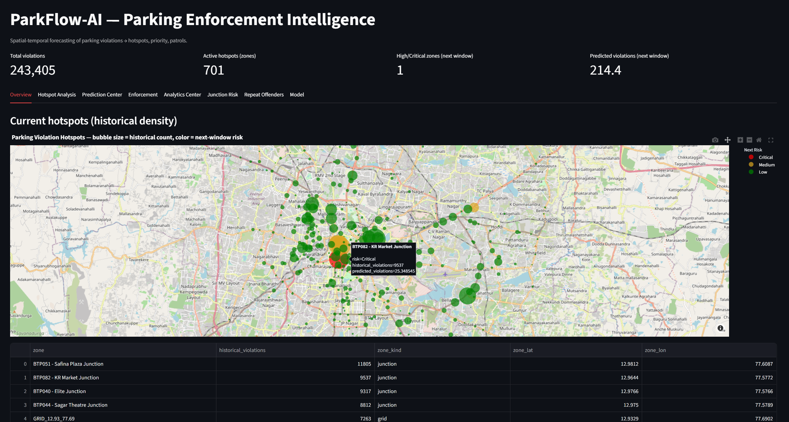

**Hotspot Analysis — violation heatmap with filters**
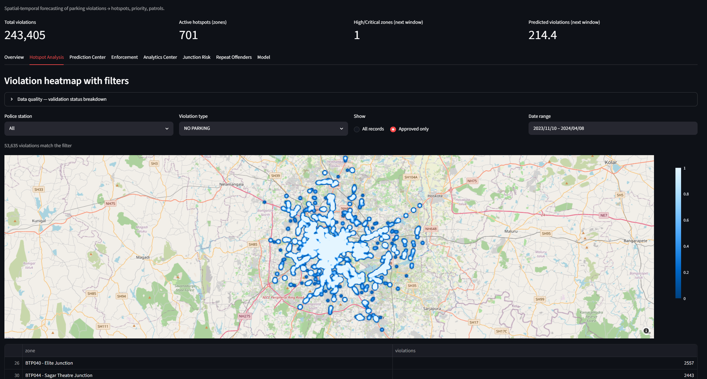

**Prediction Center — forecast + Parking Congestion Impact Index**
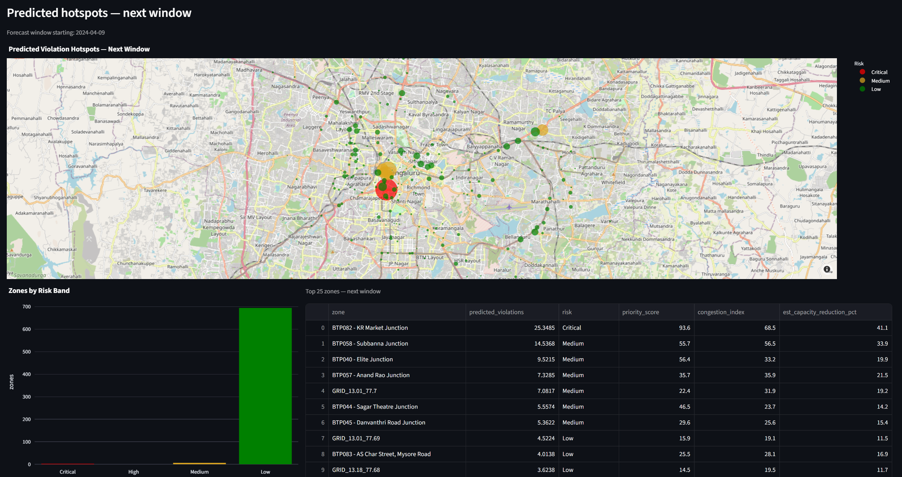

**Enforcement — patrol deployment plan**
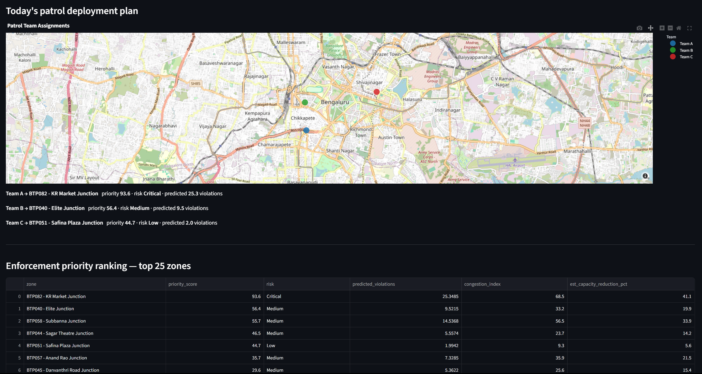

**Why this zone? — SHAP explanation**
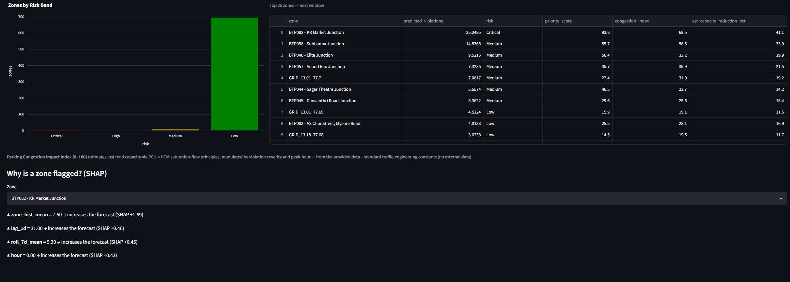

**Model — baseline vs model + diagnostics**
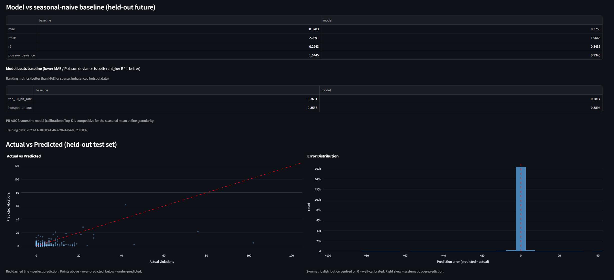

**Junction Risk assessment**
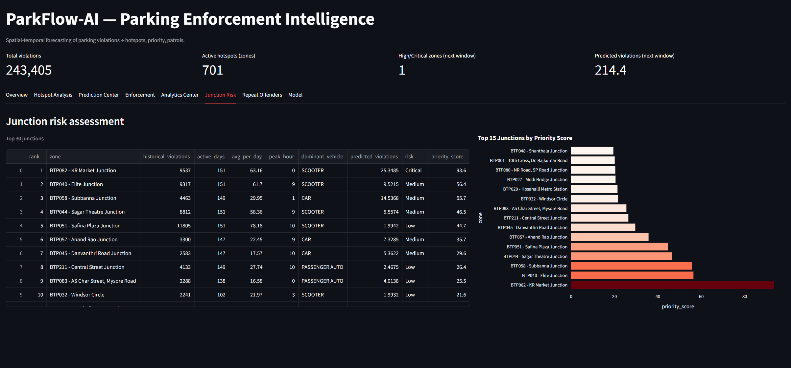

**Repeat-offender intelligence**
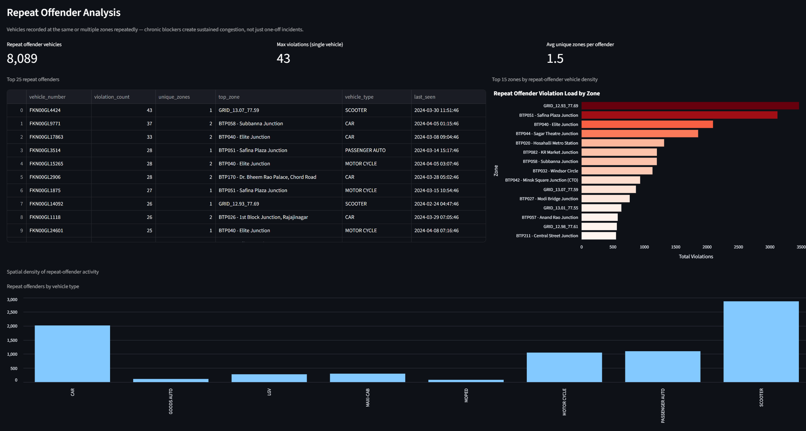

**Analytics Center — temporal trends + intensity grid**
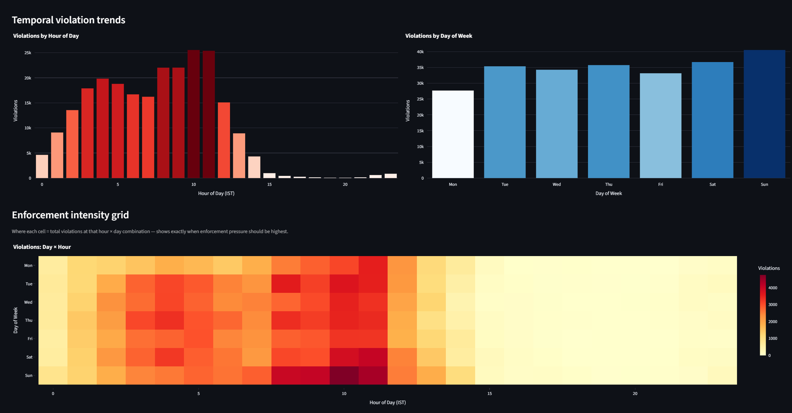

**Feature importance + global SHAP**
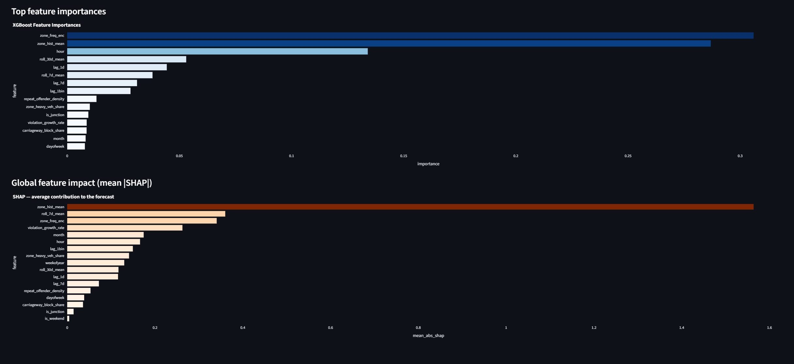

---

## 7. Project structure

```
ParkFlow-AI/
├── config/config.yaml      # every tunable (bins, model, risk bands, PCU weights)
├── dataset/                # raw BTP CSV (gitignored)
├── src/parkflow/           # pipeline package
│   ├── preprocessing.py    # clean, parse, UTC->IST, validation filter
│   ├── spatial.py          # junction / grid zoning
│   ├── features.py         # zero-fill grid + 17 features
│   ├── model.py            # XGBoost Tweedie forecaster
│   ├── baseline.py         # seasonal-naive benchmark
│   ├── evaluation.py       # MAE/RMSE/R2/Poisson + Top-K/PR-AUC
│   ├── intelligence.py     # congestion index, risk, priority, patrol (greedy + OR-Tools VRP)
│   ├── economics.py        # rupee cost of commuter delay
│   ├── displacement.py     # offender displacement / blindspot simulation
│   ├── operations.py       # operator deployment log (SQLite)
│   ├── analytics.py        # junction risk, repeat offenders, trends
│   ├── explain.py          # SHAP "why this zone"
│   └── pipeline.py         # orchestrates everything -> artifacts/
├── app/streamlit_app.py    # 9-tab dashboard (reads artifacts; operator writes to SQLite)
├── tests/                  # correctness tests (zero-fill, no leakage, economics, routing, …)
└── docs/screenshots/       # dashboard screenshots
```

---

## 8. Setup & run

```bash
# 1. setup  (add `routing` for OR-Tools VRP patrols; greedy fallback works without it)
python -m venv .venv && .venv/Scripts/activate          # Windows
pip install -e ".[dashboard,routing,dev]"

# 2. run the full pipeline (clean -> train -> evaluate -> write artifacts)
parkflow run                       # honest anchor: forecast starts after the last data bin
parkflow run --horizon 8 --live    # relabel the 24h timeline to "now" (as if on live feeds)

# 3. launch the dashboard
streamlit run app/streamlit_app.py                       # http://localhost:8501

# tests
pytest -q
```

`parkflow run` flags: `--horizon N` sets how many future 3h bins to forecast (default 8 = 24h);
`--live` only *relabels* the timeline to start now (it never changes which data feeds the model).

Dataset path is set in `config/config.yaml` (`paths.raw_data`).
**Compliance:** uses only the provided dataset + published traffic-engineering constants — no external
datasets or APIs. OR-Tools is a solver library (it ships no data); patrol distances come from the
zone coordinates already in the dataset.

---


## Developed with ❤️ by Tensor Troops

### {

### [Jaswanth Saravanan](https://github.com/Jaswanth-006) ,

### [Sajeev Senthil](https://github.com/SajeevSenthil) ,

### [Abiruth](https://github.com/abiruth29),

### [Suganth K](https://github.com/suganth07)

### }
<p align="center"><b>From reactive patrols to proactive, data-driven parking enforcement.</b></p>
